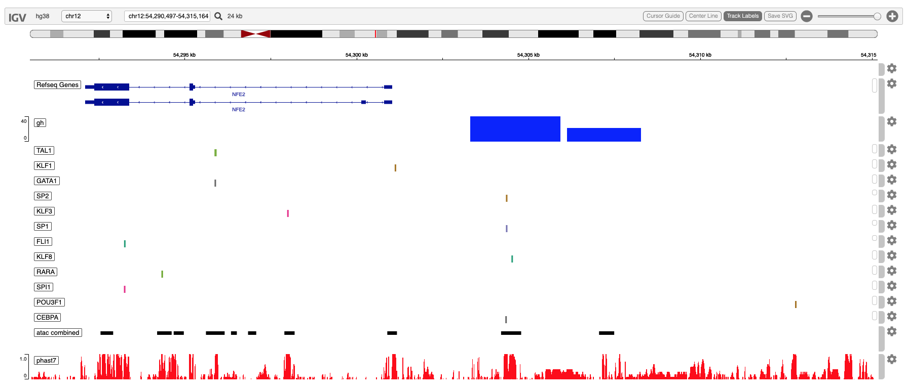

# Some introductory test

In creating a vignette, these code & output display options are useful:

1. no code display, no output
2. display code, but not output
3. display code with R prompt, but not output
4. display code and output
5. no code display, just the output
6. tasteful display of a data.frame
7. tasteful display of a data.frame, no ode
8. show a previously created image

### 1. execute code: no code display, no output
> {r label goes here, include=FALSE}

```{r load trena, include=FALSE}
library(trena)
```

### 2. execute code, display code, no output
```{r load limma, results='hide', message=FALSE}
library(limma)
```

### 3. show R prompt, execute code,  display code, no output
```{r load limma with prompt, prompt=TRUE, results='hide', message=FALSE}
library(limma)
2 + 1
```

### 5. no code display, just the output
```{r just results, prompt=FALSE, message=FALSE, echo=FALSE, results="show"}
sprintf("variant %d", 2 + 3)
```

### 6. tasteful display of a data.frame
```{r tasteful data.frame, prompt=FALSE, message=FALSE, echo=TRUE, results="show"}
knitr::kable(mtcars[1:5,], caption='mtcars')
```

### 7. tasteful display of a data.frame, no code, no caption
```{r tasteful data.frame no code, prompt=FALSE, message=FALSE, echo=FALSE, results="show"}
knitr::kable(mtcars[1:5,])
```

### 8. show png image file
```{r show png file, eval=TRUE, echo=FALSE}

```


A quote:

> Markdown is not LaTeX.

To compile me, run this in R:

    library(knitr)
    knit('001-minimal.Rmd')

See [output here](https://github.com/yihui/knitr-examples/blob/master/001-minimal.md).

## code chunks

A _paragraph_ here. A code chunk below (remember the three backticks):

```{r}
1+1
.4-.7+.3 # what? it is not zero!
```

## graphics

It is easy.

```{r}
plot(1:10)
hist(rnorm(1000))
```

## inline code

Yes I know the value of pi is `r pi`, and 2 times pi is `r 2*pi`.

## math

Sigh. You cannot live without math equations. OK, here we go:
$\alpha+\beta=\gamma$. Note this is not supported by native
markdown. You probably want to try RStudio, or at least the R package
**markdown**, or the function `knitr::knit2html()`.

## nested code chunks

You can write code within other elements, e.g. a list

1. foo is good
    ```{r}
    strsplit('hello indented world', ' ')[[1]]
    ```
2. bar is better

Or inside blockquotes:

> Here is a quote, followed by a code chunk:
>
> ```{r}
> x = 1:10
> rev(x^2)
> ```

## conclusion

Nothing fancy. You are ready to go. When you become picky, go to the [knitr website](http://yihui.name/knitr/).


